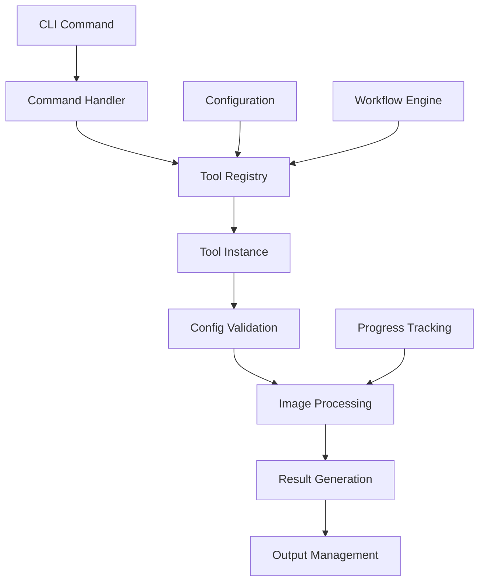

# ReTileUp Developer Guide

Complete guide for contributing to and extending ReTileUp.

## Table of Contents

- [Architecture Overview](#architecture-overview)
- [Development Setup](#development-setup)
- [Project Structure](#project-structure)
- [Contributing Guidelines](#contributing-guidelines)
- [Plugin Development](#plugin-development)
- [Testing Framework](#testing-framework)
- [Code Standards](#code-standards)
- [API Reference](#api-reference)
- [Release Process](#release-process)

## Architecture Overview

ReTileUp follows a modular, plugin-based architecture designed for extensibility and maintainability.

### Core Design Principles

1. **Modularity**: Loose coupling between components
2. **Extensibility**: Plugin-based tool system
3. **Type Safety**: Comprehensive type hints throughout
4. **Error Handling**: Graceful failure and recovery
5. **Performance**: Efficient memory usage and processing
6. **Testing**: Comprehensive test coverage >95%

### Architecture Diagram

```
┌─────────────────────────────────────────────────────────────┐
│                      CLI Interface                          │
│  ┌─────────────┐ ┌─────────────┐ ┌─────────────────────────┐ │
│  │ tile        │ │ workflow    │ │ list-tools / validate   │ │
│  └─────────────┘ └─────────────┘ └─────────────────────────┘ │
└─────────────────────┬───────────────────────────────────────┘
                      │
┌─────────────────────▼───────────────────────────────────────┐
│                    Core Framework                           │
│  ┌─────────────┐ ┌─────────────┐ ┌─────────────────────────┐ │
│  │ Config      │ │ Registry    │ │ WorkflowOrchestrator    │ │
│  │ Management  │ │ System      │ │                         │ │
│  └─────────────┘ └─────────────┘ └─────────────────────────┘ │
└─────────────────────┬───────────────────────────────────────┘
                      │
┌─────────────────────▼───────────────────────────────────────┐
│                   Tool Framework                            │
│  ┌─────────────┐ ┌─────────────┐ ┌─────────────────────────┐ │
│  │ BaseTool    │ │ ToolConfig  │ │ ToolResult              │ │
│  │ Abstract    │ │ Validation  │ │ Output Management       │ │
│  └─────────────┘ └─────────────┘ └─────────────────────────┘ │
└─────────────────────┬───────────────────────────────────────┘
                      │
┌─────────────────────▼───────────────────────────────────────┐
│                Processing Tools                             │
│  ┌─────────────┐ ┌─────────────┐ ┌─────────────────────────┐ │
│  │ TilingTool  │ │ ResizeTool  │ │ Custom Tools            │ │
│  │             │ │ (Future)    │ │ (Plugin System)         │ │
│  └─────────────┘ └─────────────┘ └─────────────────────────┘ │
└─────────────────────┬───────────────────────────────────────┘
                      │
┌─────────────────────▼───────────────────────────────────────┐
│                  Utility Layer                              │
│  ┌─────────────┐ ┌─────────────┐ ┌─────────────────────────┐ │
│  │ ImageUtils  │ │ Validation  │ │ Progress Tracking       │ │
│  │             │ │ Framework   │ │                         │ │
│  └─────────────┘ └─────────────┘ └─────────────────────────┘ │
└─────────────────────────────────────────────────────────────┘
```

### Component Interaction



## Development Setup

### Prerequisites

- Python 3.8+ (tested on 3.8, 3.9, 3.10, 3.11, 3.12)
- Git
- IDE with Python support (VS Code, PyCharm recommended)

### Initial Setup

```bash
# Clone repository
git clone https://github.com/yourusername/retileup.git
cd retileup

# Create virtual environment
python -m venv venv
source venv/bin/activate  # On Windows: venv\Scripts\activate

# Install development dependencies
pip install -e ".[dev]"

# Install pre-commit hooks
pre-commit install

# Verify setup
pytest --version
black --version
mypy --version
```

### Development Dependencies

```toml
[project.optional-dependencies]
dev = [
    "pytest>=7.0.0",
    "pytest-cov>=4.0.0",
    "pytest-mock>=3.10.0",
    "black>=23.0.0",
    "mypy>=1.0.0",
    "ruff>=0.1.0",
    "pre-commit>=3.0.0",
    "types-PyYAML>=6.0.0",
    "types-Pillow>=10.0.0",
]
```

### IDE Configuration

#### VS Code Settings

```json
{
    "python.defaultInterpreterPath": "./venv/bin/python",
    "python.linting.enabled": true,
    "python.linting.pylintEnabled": false,
    "python.linting.mypyEnabled": true,
    "python.formatting.provider": "black",
    "python.formatting.blackArgs": ["--line-length", "88"],
    "editor.formatOnSave": true,
    "python.testing.pytestEnabled": true,
    "python.testing.pytestArgs": ["tests/"],
}
```

#### PyCharm Configuration

1. Set Python interpreter to `./venv/bin/python`
2. Enable Black formatter: File → Settings → Tools → External Tools
3. Configure pytest: Run → Edit Configurations → Python tests → pytest
4. Enable type checking: Settings → Editor → Inspections → Python → Type checker

### Development Workflow

1. **Create Feature Branch**
   ```bash
   git checkout -b feature/your-feature-name
   ```

2. **Make Changes**
   - Follow code standards (see below)
   - Add tests for new functionality
   - Update documentation

3. **Run Quality Checks**
   ```bash
   # Run tests
   pytest

   # Check formatting
   black --check src tests

   # Check linting
   ruff check src tests

   # Type checking
   mypy src

   # Pre-commit checks
   pre-commit run --all-files
   ```

4. **Commit Changes**
   ```bash
   git add .
   git commit -m "feat: add new feature description"
   ```

5. **Push and Create PR**
   ```bash
   git push origin feature/your-feature-name
   # Create pull request on GitHub
   ```

## Project Structure

### Directory Layout

```
retileup/
├── src/retileup/              # Main package
│   ├── __init__.py           # Public API exports
│   ├── __main__.py           # Module entry point
│   ├── cli/                  # Command-line interface
│   │   ├── __init__.py
│   │   ├── main.py           # CLI application
│   │   ├── completion.py     # Shell completion
│   │   └── commands/         # Individual commands
│   │       ├── __init__.py
│   │       ├── tile.py       # Tile command
│   │       ├── workflow.py   # Workflow command
│   │       └── utils.py      # Utility commands
│   ├── core/                 # Core framework
│   │   ├── __init__.py
│   │   ├── config.py         # Configuration management
│   │   ├── exceptions.py     # Custom exceptions
│   │   ├── orchestrator.py   # Workflow orchestrator
│   │   ├── registry.py       # Tool registry
│   │   └── workflow.py       # Workflow definitions
│   ├── tools/                # Processing tools
│   │   ├── __init__.py
│   │   ├── base.py           # Base tool classes
│   │   └── tiling.py         # Tiling tool implementation
│   └── utils/                # Utility modules
│       ├── __init__.py
│       ├── image.py          # Image utilities
│       └── validation.py     # Validation utilities
├── tests/                    # Test suite
│   ├── __init__.py
│   ├── conftest.py           # Pytest configuration
│   ├── fixtures/             # Test fixtures
│   ├── unit/                 # Unit tests
│   ├── integration/          # Integration tests
│   ├── edge_cases/           # Edge case tests
│   └── performance/          # Performance tests
├── examples/                 # Usage examples
│   ├── scripts/              # Example scripts
│   ├── workflows/            # Example workflows
│   └── data/                 # Sample data
├── docs/                     # Documentation
│   ├── USER_GUIDE.md
│   ├── DEVELOPER_GUIDE.md
│   └── api/                  # API documentation
├── pyproject.toml            # Project configuration
├── README.md                 # Project overview
└── LICENSE                   # License file
```

### Key Files

#### `src/retileup/__init__.py`
Defines the public API and exports main classes:

```python
"""ReTileUp: A modular CLI toolkit for advanced image processing."""

__version__ = "0.1.0"

# Public API
from .core.config import Config
from .core.registry import ToolRegistry
from .core.orchestrator import WorkflowOrchestrator
from .core.workflow import Workflow, WorkflowStep

__all__ = [
    "__version__",
    "Config",
    "ToolRegistry",
    "WorkflowOrchestrator",
    "Workflow",
    "WorkflowStep",
]
```

#### `pyproject.toml`
Project configuration including dependencies, build settings, and tool configurations.

#### Test Configuration
- `pytest.ini`: Pytest configuration
- `conftest.py`: Shared test fixtures
- Coverage configuration in `pyproject.toml`

## Contributing Guidelines

### Code of Conduct

We follow the [Contributor Covenant Code of Conduct](https://www.contributor-covenant.org/). Please be respectful and professional in all interactions.

### Contribution Process

1. **Check Existing Issues**
   - Look for existing issues or discussions
   - Comment on issues you'd like to work on

2. **Create Issue (if needed)**
   - Use appropriate templates
   - Provide clear descriptions and examples
   - Label appropriately

3. **Fork and Clone**
   ```bash
   # Fork on GitHub, then:
   git clone https://github.com/your-username/retileup.git
   cd retileup
   ```

4. **Create Feature Branch**
   ```bash
   git checkout -b feature/descriptive-name
   ```

5. **Implement Changes**
   - Follow code standards
   - Add comprehensive tests
   - Update documentation

6. **Quality Assurance**
   ```bash
   # Run full test suite
   pytest

   # Check code quality
   make lint
   make type-check
   make format-check
   ```

7. **Commit and Push**
   ```bash
   git add .
   git commit -m "type: descriptive commit message"
   git push origin feature/descriptive-name
   ```

8. **Create Pull Request**
   - Use PR template
   - Link related issues
   - Request appropriate reviewers

### Commit Message Format

We use [Conventional Commits](https://www.conventionalcommits.org/):

```
type(scope): description

[optional body]

[optional footer]
```

**Types:**
- `feat`: New feature
- `fix`: Bug fix
- `docs`: Documentation changes
- `style`: Code style changes (formatting, etc.)
- `refactor`: Code refactoring
- `test`: Adding or updating tests
- `chore`: Maintenance tasks

**Examples:**
```
feat(cli): add grid-based tiling support
fix(tools): handle edge case in coordinate validation
docs: update installation instructions
test: add integration tests for workflow engine
```

### Pull Request Guidelines

1. **Use PR Template**
   - Fill out all sections
   - Link related issues
   - Describe changes clearly

2. **Code Quality**
   - All tests must pass
   - Code coverage should not decrease
   - Type checking must pass
   - Linting must pass

3. **Documentation**
   - Update relevant documentation
   - Add docstrings for new functions/classes
   - Update API documentation if needed

4. **Breaking Changes**
   - Document breaking changes clearly
   - Update migration guide
   - Consider backwards compatibility

## Plugin Development

### Creating a New Tool

Tools are the core processing units in ReTileUp. Here's how to create a custom tool:

#### 1. Define Tool Configuration

```python
# src/retileup/tools/my_tool.py
from typing import List, Optional
from pydantic import BaseModel, Field
from .base import ToolConfig

class MyToolConfig(ToolConfig):
    """Configuration for MyTool."""

    parameter1: int = Field(
        ...,
        description="Required parameter",
        ge=1,
        le=100
    )
    parameter2: Optional[str] = Field(
        None,
        description="Optional parameter",
        min_length=1
    )

    @field_validator('parameter2')
    @classmethod
    def validate_parameter2(cls, v):
        if v and 'invalid' in v.lower():
            raise ValueError('Invalid value for parameter2')
        return v
```

#### 2. Implement Tool Class

```python
from typing import Type
from PIL import Image
from .base import BaseTool, ToolResult

class MyTool(BaseTool):
    """Custom processing tool."""

    name = "my_tool"
    description = "Description of what the tool does"
    version = "1.0.0"
    config_class = MyToolConfig

    def process(self, image_path: str, config: MyToolConfig) -> ToolResult:
        """Process an image according to the configuration.

        Args:
            image_path: Path to input image
            config: Tool configuration

        Returns:
            ToolResult with processing results
        """
        try:
            # Load image
            image = Image.open(image_path)

            # Process image based on config
            processed_image = self._process_image(image, config)

            # Save result
            output_path = self._generate_output_path(image_path, config)
            processed_image.save(output_path)

            return ToolResult(
                success=True,
                outputs=[output_path],
                metadata={
                    'original_size': image.size,
                    'output_size': processed_image.size,
                    'parameter1': config.parameter1,
                }
            )

        except Exception as e:
            return ToolResult(
                success=False,
                error=str(e),
                outputs=[]
            )

    def _process_image(self, image: Image.Image, config: MyToolConfig) -> Image.Image:
        """Implement your image processing logic here."""
        # Your processing logic
        return image

    def _generate_output_path(self, input_path: str, config: MyToolConfig) -> str:
        """Generate output file path."""
        # Your path generation logic
        return f"processed_{input_path}"
```

#### 3. Register Tool

```python
# Add to src/retileup/tools/__init__.py
from .my_tool import MyTool

__all__ = [
    "MyTool",
    # ... other tools
]

# Tool will be auto-registered by the registry system
```

#### 4. Add CLI Command (Optional)

```python
# src/retileup/cli/commands/my_command.py
import typer
from rich.console import Console
from retileup.core.registry import get_global_registry
from retileup.tools.my_tool import MyToolConfig

def my_command(
    parameter1: int = typer.Option(..., help="Required parameter"),
    parameter2: str = typer.Option(None, help="Optional parameter"),
    input_file: str = typer.Argument(..., help="Input image file"),
) -> None:
    """Run MyTool processing."""

    console = Console()

    try:
        # Create configuration
        config = MyToolConfig(
            parameter1=parameter1,
            parameter2=parameter2
        )

        # Get tool from registry
        registry = get_global_registry()
        tool = registry.get_tool("my_tool")

        # Process image
        result = tool.process(input_file, config)

        if result.success:
            console.print(f"[green]Success![/green] Processed {len(result.outputs)} outputs")
        else:
            console.print(f"[red]Error:[/red] {result.error}")

    except Exception as e:
        console.print(f"[red]Error:[/red] {e}")
        raise typer.Exit(1)
```

### Plugin System Architecture

ReTileUp uses a dynamic plugin system that automatically discovers and registers tools:

#### Tool Discovery

```python
# src/retileup/core/registry.py
class ToolRegistry:
    """Registry for managing processing tools."""

    def __init__(self):
        self._tools: Dict[str, BaseTool] = {}
        self._discover_tools()

    def _discover_tools(self) -> None:
        """Automatically discover and register tools."""
        for module_name in self._get_tool_modules():
            module = importlib.import_module(f"retileup.tools.{module_name}")

            for attr_name in dir(module):
                attr = getattr(module, attr_name)

                if (isinstance(attr, type) and
                    issubclass(attr, BaseTool) and
                    attr != BaseTool):

                    tool_instance = attr()
                    self.register_tool(tool_instance)
```

#### External Plugins

For external plugins, create a package structure:

```
my_retileup_plugin/
├── setup.py
├── my_retileup_plugin/
│   ├── __init__.py
│   └── tools/
│       ├── __init__.py
│       └── my_external_tool.py
└── README.md
```

Register via entry points in `setup.py`:

```python
setup(
    name="my-retileup-plugin",
    entry_points={
        "retileup.tools": [
            "my_external_tool = my_retileup_plugin.tools.my_external_tool:MyExternalTool",
        ],
    },
)
```

### Advanced Plugin Features

#### Plugin Configuration

```python
class AdvancedToolConfig(ToolConfig):
    """Advanced tool configuration with custom validation."""

    # Complex validation
    @model_validator(mode='after')
    def validate_configuration(self):
        # Complex validation logic
        return self

    # Custom serialization
    def model_dump_custom(self):
        return {
            'custom_format': 'value'
        }
```

#### Plugin Metadata

```python
class AdvancedTool(BaseTool):
    """Advanced tool with rich metadata."""

    name = "advanced_tool"
    description = "Advanced processing capabilities"
    version = "2.1.0"
    author = "Plugin Developer"
    license = "MIT"

    # Capability declarations
    supported_formats = ["JPEG", "PNG", "TIFF"]
    requires_gpu = False
    memory_intensive = True

    # Plugin dependencies
    dependencies = ["numpy>=1.21.0", "opencv-python>=4.5.0"]
```

## Testing Framework

ReTileUp has a comprehensive testing framework with 491 tests across multiple categories.

### Test Structure

```
tests/
├── conftest.py              # Shared fixtures
├── fixtures/                # Test data generation
├── unit/                    # Unit tests (275 tests)
│   ├── test_core/          # Core functionality tests
│   ├── test_tools/         # Tool-specific tests
│   └── test_utils/         # Utility tests
├── integration/             # Integration tests (156 tests)
│   ├── test_cli.py         # CLI integration
│   ├── test_workflows.py   # Workflow testing
│   └── test_end_to_end.py  # Complete workflows
├── edge_cases/              # Edge case tests
└── performance/             # Performance tests (60 tests)
```

### Running Tests

```bash
# Run all tests
pytest

# Run specific categories
pytest -m unit
pytest -m integration
pytest -m performance

# Run with coverage
pytest --cov=retileup --cov-report=html

# Run specific test file
pytest tests/unit/test_tools/test_tiling.py

# Run with verbose output
pytest -v

# Run parallel tests
pytest -n auto
```

### Writing Tests

#### Unit Test Example

```python
# tests/unit/test_tools/test_my_tool.py
import pytest
from PIL import Image
from retileup.tools.my_tool import MyTool, MyToolConfig
from retileup.core.exceptions import ValidationError

class TestMyTool:
    """Unit tests for MyTool."""

    def test_init(self):
        """Test tool initialization."""
        tool = MyTool()
        assert tool.name == "my_tool"
        assert tool.version == "1.0.0"

    def test_config_validation_valid(self):
        """Test valid configuration."""
        config = MyToolConfig(parameter1=50)
        assert config.parameter1 == 50

    def test_config_validation_invalid(self):
        """Test invalid configuration."""
        with pytest.raises(ValidationError):
            MyToolConfig(parameter1=0)  # Below minimum

    def test_process_success(self, sample_image_path):
        """Test successful processing."""
        tool = MyTool()
        config = MyToolConfig(parameter1=50)

        result = tool.process(sample_image_path, config)

        assert result.success
        assert len(result.outputs) == 1
        assert result.error is None

    def test_process_invalid_image(self):
        """Test processing with invalid image."""
        tool = MyTool()
        config = MyToolConfig(parameter1=50)

        result = tool.process("nonexistent.jpg", config)

        assert not result.success
        assert result.error is not None
        assert len(result.outputs) == 0
```

#### Integration Test Example

```python
# tests/integration/test_my_tool_integration.py
import pytest
from pathlib import Path
from retileup.cli.main import app
from typer.testing import CliRunner

class TestMyToolIntegration:
    """Integration tests for MyTool CLI."""

    def test_cli_command(self, sample_image_path, tmp_path):
        """Test CLI command execution."""
        runner = CliRunner()

        result = runner.invoke(app, [
            "my-command",
            "--parameter1", "50",
            str(sample_image_path)
        ])

        assert result.exit_code == 0
        assert "Success!" in result.stdout

    def test_workflow_integration(self, sample_image_path, tmp_path):
        """Test tool integration in workflows."""
        workflow_config = {
            "name": "test-workflow",
            "steps": [
                {
                    "name": "process",
                    "tool": "my_tool",
                    "config": {"parameter1": 50}
                }
            ]
        }

        # Execute workflow and verify results
        # ... workflow execution logic
```

#### Performance Test Example

```python
# tests/performance/test_my_tool_performance.py
import time
import pytest
from retileup.tools.my_tool import MyTool, MyToolConfig

class TestMyToolPerformance:
    """Performance tests for MyTool."""

    @pytest.mark.performance
    def test_processing_speed(self, large_sample_image):
        """Test processing speed with large images."""
        tool = MyTool()
        config = MyToolConfig(parameter1=50)

        start_time = time.time()
        result = tool.process(large_sample_image, config)
        processing_time = time.time() - start_time

        assert result.success
        assert processing_time < 5.0  # Max 5 seconds

    @pytest.mark.performance
    def test_memory_usage(self, sample_image_path):
        """Test memory usage during processing."""
        import psutil
        import os

        process = psutil.Process(os.getpid())
        initial_memory = process.memory_info().rss

        tool = MyTool()
        config = MyToolConfig(parameter1=50)
        result = tool.process(sample_image_path, config)

        final_memory = process.memory_info().rss
        memory_increase = final_memory - initial_memory

        assert memory_increase < 100 * 1024 * 1024  # Max 100MB increase
```

### Test Fixtures

```python
# tests/conftest.py
import pytest
from pathlib import Path
from PIL import Image

@pytest.fixture
def sample_image_path(tmp_path):
    """Create a sample image for testing."""
    image_path = tmp_path / "sample.jpg"
    image = Image.new("RGB", (800, 600), color="red")
    image.save(image_path)
    return str(image_path)

@pytest.fixture
def large_sample_image(tmp_path):
    """Create a large sample image for performance testing."""
    image_path = tmp_path / "large.jpg"
    image = Image.new("RGB", (4000, 3000), color="blue")
    image.save(image_path)
    return str(image_path)

@pytest.fixture
def tool_registry():
    """Provide a clean tool registry for testing."""
    from retileup.core.registry import ToolRegistry
    return ToolRegistry()
```

### Mocking and Test Isolation

```python
# tests/unit/test_tools/test_with_mocks.py
import pytest
from unittest.mock import Mock, patch
from retileup.tools.my_tool import MyTool

class TestMyToolWithMocks:
    """Test MyTool with mocked dependencies."""

    @patch('retileup.tools.my_tool.Image.open')
    def test_process_with_mock_image(self, mock_open):
        """Test processing with mocked image loading."""
        # Setup mock
        mock_image = Mock()
        mock_image.size = (800, 600)
        mock_open.return_value = mock_image

        tool = MyTool()
        config = MyToolConfig(parameter1=50)

        result = tool.process("fake_path.jpg", config)

        # Verify mock was called
        mock_open.assert_called_once_with("fake_path.jpg")
        assert result.success
```

## Code Standards

### Python Style Guide

ReTileUp follows [PEP 8](https://pep8.org/) with some specific conventions:

#### Code Formatting

- **Line Length**: 88 characters (Black default)
- **Indentation**: 4 spaces
- **Quotes**: Double quotes for strings
- **Imports**: Sorted and grouped (isort)

```python
# Good
from typing import List, Optional, Dict, Any

import logging
from pathlib import Path

from PIL import Image
from pydantic import BaseModel, Field

from retileup.core.base import BaseTool
from retileup.utils.image import ImageUtils

# Bad
from PIL import Image
import logging
from retileup.core.base import BaseTool
from typing import List, Optional
```

#### Naming Conventions

```python
# Classes: PascalCase
class ImageProcessor:
    pass

# Functions and variables: snake_case
def process_image(image_path: str) -> bool:
    file_size = get_file_size(image_path)
    return file_size > 0

# Constants: UPPER_SNAKE_CASE
MAX_IMAGE_SIZE = 8192
DEFAULT_QUALITY = 95

# Private members: leading underscore
class Tool:
    def __init__(self):
        self._internal_state = {}

    def _helper_method(self):
        pass
```

#### Type Hints

All public functions and methods must have type hints:

```python
from typing import List, Optional, Dict, Any, Union
from pathlib import Path

def process_images(
    image_paths: List[str],
    output_dir: Path,
    config: Optional[Dict[str, Any]] = None
) -> List[str]:
    """Process multiple images.

    Args:
        image_paths: List of input image file paths
        output_dir: Directory for output files
        config: Optional configuration dictionary

    Returns:
        List of output file paths

    Raises:
        ProcessingError: If processing fails
    """
    # Implementation
    pass
```

#### Docstring Standards

Use Google-style docstrings:

```python
class TilingTool:
    """Tool for extracting rectangular tiles from images.

    This tool provides functionality to extract rectangular tiles
    from images at specified coordinates or in grid patterns.

    Attributes:
        name: Tool identifier
        version: Tool version string

    Example:
        >>> tool = TilingTool()
        >>> config = TilingConfig(tile_width=256, tile_height=256, coordinates=[(0, 0)])
        >>> result = tool.process("image.jpg", config)
    """

    def process(self, image_path: str, config: TilingConfig) -> ToolResult:
        """Process an image to extract tiles.

        Args:
            image_path: Path to the input image file
            config: Configuration object with tiling parameters

        Returns:
            ToolResult object containing processing results and metadata

        Raises:
            ValidationError: If configuration is invalid
            ProcessingError: If image processing fails
            FileNotFoundError: If input image file doesn't exist
        """
        pass
```

### Code Quality Tools

#### Black (Code Formatting)

```bash
# Format code
black src tests

# Check formatting without changes
black --check src tests

# Configuration in pyproject.toml
[tool.black]
line-length = 88
target-version = ['py38']
```

#### Ruff (Linting)

```bash
# Run linting
ruff check src tests

# Fix auto-fixable issues
ruff check --fix src tests

# Configuration in pyproject.toml
[tool.ruff]
line-length = 88
select = ["E", "W", "F", "I", "B", "C4", "UP"]
```

#### MyPy (Type Checking)

```bash
# Run type checking
mypy src

# Configuration in pyproject.toml
[tool.mypy]
python_version = "3.8"
disallow_untyped_defs = true
strict_equality = true
```

#### Pre-commit Hooks

```yaml
# .pre-commit-config.yaml
repos:
  - repo: https://github.com/psf/black
    rev: 23.1.0
    hooks:
      - id: black
        language_version: python3

  - repo: https://github.com/charliermarsh/ruff-pre-commit
    rev: v0.1.0
    hooks:
      - id: ruff
        args: [--fix, --exit-non-zero-on-fix]

  - repo: https://github.com/pre-commit/mirrors-mypy
    rev: v1.0.0
    hooks:
      - id: mypy
        additional_dependencies: [types-PyYAML, types-Pillow]
```

### Error Handling

#### Custom Exceptions

```python
# src/retileup/core/exceptions.py
class RetileupError(Exception):
    """Base exception for ReTileUp errors."""

    def __init__(self, message: str, error_code: int = 1):
        super().__init__(message)
        self.message = message
        self.error_code = error_code

class ValidationError(RetileupError):
    """Raised when input validation fails."""

    def __init__(self, message: str, field: str = None):
        super().__init__(message, error_code=2)
        self.field = field

class ProcessingError(RetileupError):
    """Raised when image processing fails."""

    def __init__(self, message: str, image_path: str = None):
        super().__init__(message, error_code=3)
        self.image_path = image_path
```

#### Error Handling Patterns

```python
def robust_processing_function(image_path: str) -> ToolResult:
    """Example of robust error handling."""
    try:
        # Validate inputs
        if not Path(image_path).exists():
            raise FileNotFoundError(f"Image file not found: {image_path}")

        # Process image
        result = process_image(image_path)

        return ToolResult(success=True, outputs=[result])

    except FileNotFoundError as e:
        logger.error(f"File error: {e}")
        return ToolResult(success=False, error=str(e))

    except ValidationError as e:
        logger.error(f"Validation error: {e}")
        return ToolResult(success=False, error=f"Invalid configuration: {e}")

    except ProcessingError as e:
        logger.error(f"Processing error: {e}")
        return ToolResult(success=False, error=f"Processing failed: {e}")

    except Exception as e:
        logger.exception("Unexpected error during processing")
        return ToolResult(success=False, error=f"Unexpected error: {e}")
```

### Logging

```python
import logging

# Configure logging
logger = logging.getLogger(__name__)

class SampleClass:
    def process_data(self, data):
        """Example of proper logging usage."""
        logger.info(f"Starting processing for {len(data)} items")

        try:
            # Processing logic
            result = self._process(data)
            logger.info(f"Successfully processed {len(result)} items")
            return result

        except Exception as e:
            logger.error(f"Processing failed: {e}", exc_info=True)
            raise

    def _process(self, data):
        logger.debug("Entering internal processing method")
        # Internal processing
        return processed_data
```

## API Reference

### Core Classes

#### BaseTool

Abstract base class for all processing tools.

```python
class BaseTool(ABC):
    """Abstract base class for image processing tools."""

    name: str                    # Tool identifier
    description: str             # Human-readable description
    version: str                # Tool version
    config_class: Type[ToolConfig]  # Configuration class

    @abstractmethod
    def process(self, image_path: str, config: ToolConfig) -> ToolResult:
        """Process an image according to the configuration."""
        pass
```

#### ToolConfig

Base configuration class with validation.

```python
class ToolConfig(BaseModel):
    """Base configuration for processing tools."""

    # Common configuration fields
    output_pattern: str = "{base}_{tool}.{ext}"
    output_format: Optional[str] = None
    quality: int = Field(95, ge=1, le=100)

    # Validation methods
    @field_validator('output_pattern')
    @classmethod
    def validate_output_pattern(cls, v):
        if not v.strip():
            raise ValueError("Output pattern cannot be empty")
        return v
```

#### ToolResult

Container for processing results.

```python
class ToolResult(BaseModel):
    """Result of a tool processing operation."""

    success: bool
    outputs: List[str] = Field(default_factory=list)
    error: Optional[str] = None
    metadata: Dict[str, Any] = Field(default_factory=dict)
    processing_time: Optional[float] = None
```

#### ToolRegistry

Registry for managing available tools.

```python
class ToolRegistry:
    """Registry for managing processing tools."""

    def register_tool(self, tool: BaseTool) -> None:
        """Register a tool instance."""

    def get_tool(self, name: str) -> BaseTool:
        """Get a tool by name."""

    def list_tools(self) -> List[str]:
        """List all registered tool names."""

    def get_tool_info(self, name: str) -> Dict[str, Any]:
        """Get detailed information about a tool."""
```

#### WorkflowOrchestrator

Orchestrates multi-step workflows.

```python
class WorkflowOrchestrator:
    """Orchestrates execution of multi-step workflows."""

    def __init__(self, registry: ToolRegistry, config: Config):
        self.registry = registry
        self.config = config

    def execute_workflow(
        self,
        workflow: Workflow,
        inputs: List[str]
    ) -> List[ToolResult]:
        """Execute a workflow on input files."""
```

### Utility Functions

#### ImageUtils

Image processing utilities.

```python
class ImageUtils:
    """Utility functions for image processing."""

    @staticmethod
    def get_image_info(image_path: str) -> Dict[str, Any]:
        """Get detailed information about an image."""

    @staticmethod
    def validate_image_format(image_path: str) -> bool:
        """Validate if file is a supported image format."""

    @staticmethod
    def calculate_grid_coordinates(
        image_size: Tuple[int, int],
        tile_size: Tuple[int, int],
        grid_size: Tuple[int, int]
    ) -> List[Tuple[int, int]]:
        """Calculate grid coordinates for tiling."""
```

### CLI Framework

#### Command Structure

```python
# CLI command template
def command_function(
    # Required arguments
    input_file: str = typer.Argument(..., help="Input file path"),

    # Required options
    required_param: int = typer.Option(..., help="Required parameter"),

    # Optional options with defaults
    optional_param: str = typer.Option("default", help="Optional parameter"),

    # Context for global options
    ctx: typer.Context
) -> None:
    """Command description.

    Detailed help text with examples.
    """
    # Get global state
    global_state = ctx.obj
    verbose = global_state.get("verbose", False)

    try:
        # Command implementation
        pass

    except Exception as e:
        console.print(f"[red]Error:[/red] {e}")
        raise typer.Exit(1)
```

## Release Process

### Version Management

ReTileUp follows [Semantic Versioning (SemVer)](https://semver.org/):

- **MAJOR.MINOR.PATCH** (e.g., 1.2.3)
- **MAJOR**: Breaking changes
- **MINOR**: New features (backwards compatible)
- **PATCH**: Bug fixes (backwards compatible)

### Release Checklist

#### Pre-Release

1. **Update Version**
   ```python
   # src/retileup/__init__.py
   __version__ = "1.2.3"
   ```

2. **Update Changelog**
   ```markdown
   # CHANGELOG.md
   ## [1.2.3] - 2024-01-15

   ### Added
   - New feature descriptions

   ### Changed
   - Modified feature descriptions

   ### Fixed
   - Bug fix descriptions
   ```

3. **Run Full Test Suite**
   ```bash
   pytest
   pytest -m integration
   pytest -m performance
   ```

4. **Quality Checks**
   ```bash
   black --check src tests
   ruff check src tests
   mypy src
   ```

5. **Documentation Updates**
   - Update README.md
   - Update API documentation
   - Verify examples work

#### Release

1. **Create Release Branch**
   ```bash
   git checkout -b release/v1.2.3
   git commit -am "Prepare release v1.2.3"
   ```

2. **Tag Release**
   ```bash
   git tag -a v1.2.3 -m "Release version 1.2.3"
   ```

3. **Build Distribution**
   ```bash
   python -m build
   twine check dist/*
   ```

4. **Merge to Main**
   ```bash
   git checkout main
   git merge release/v1.2.3
   git push origin main --tags
   ```

#### Post-Release

1. **Upload to PyPI** (when ready)
   ```bash
   twine upload dist/*
   ```

2. **Create GitHub Release**
   - Upload distribution files
   - Add release notes
   - Mark as latest release

3. **Update Documentation Sites**
   - Deploy updated documentation
   - Update examples

### Continuous Integration

#### GitHub Actions Workflow

```yaml
# .github/workflows/ci.yml
name: CI

on: [push, pull_request]

jobs:
  test:
    runs-on: ubuntu-latest
    strategy:
      matrix:
        python-version: [3.8, 3.9, "3.10", "3.11", "3.12"]

    steps:
    - uses: actions/checkout@v3

    - name: Set up Python ${{ matrix.python-version }}
      uses: actions/setup-python@v4
      with:
        python-version: ${{ matrix.python-version }}

    - name: Install dependencies
      run: |
        python -m pip install --upgrade pip
        pip install -e ".[dev]"

    - name: Run tests
      run: pytest --cov=retileup

    - name: Upload coverage
      uses: codecov/codecov-action@v3

  lint:
    runs-on: ubuntu-latest
    steps:
    - uses: actions/checkout@v3
    - uses: actions/setup-python@v4
      with:
        python-version: 3.9

    - name: Install dependencies
      run: pip install -e ".[dev]"

    - name: Run linting
      run: |
        black --check src tests
        ruff check src tests
        mypy src
```

---

## Support and Community

### Getting Help

- 📚 **Documentation**: [Read the Docs](https://retileup.readthedocs.io)
- 🐛 **Issues**: [GitHub Issues](https://github.com/yourusername/retileup/issues)
- 💬 **Discussions**: [GitHub Discussions](https://github.com/yourusername/retileup/discussions)

### Contributing

We welcome all types of contributions:

- 🐛 Bug reports and fixes
- ✨ Feature requests and implementations
- 📚 Documentation improvements
- 🧪 Test coverage improvements
- 🎨 UI/UX improvements
- 🌍 Translations and internationalization

Thank you for contributing to ReTileUp! 🎉